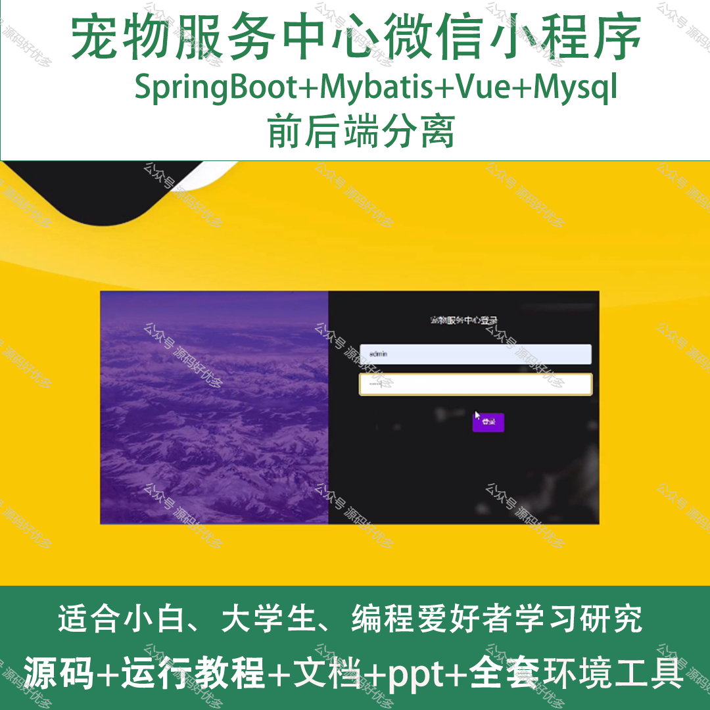
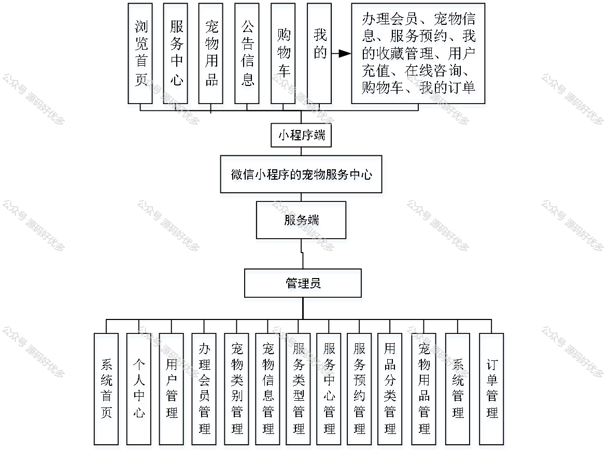
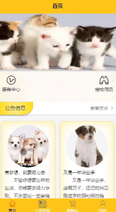
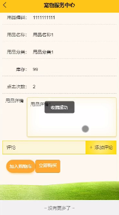
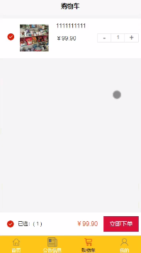
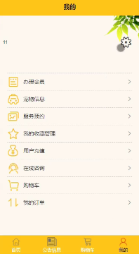
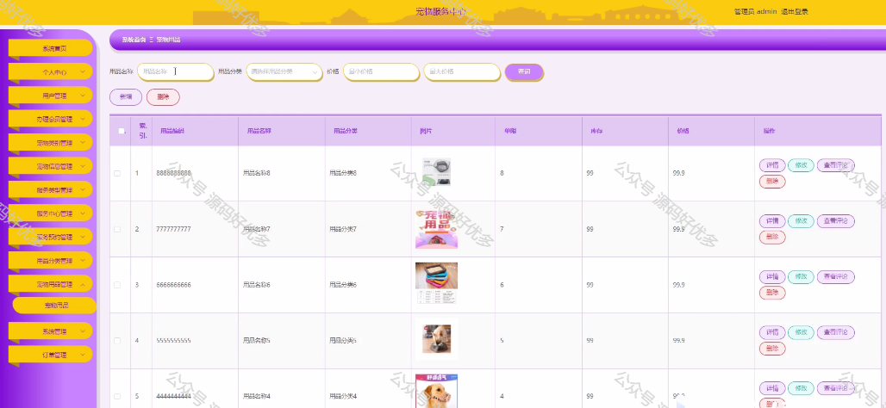
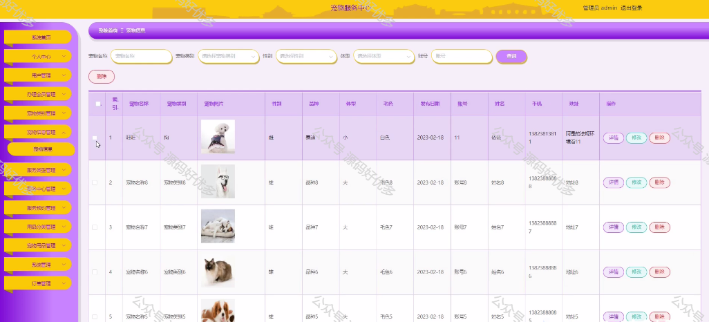
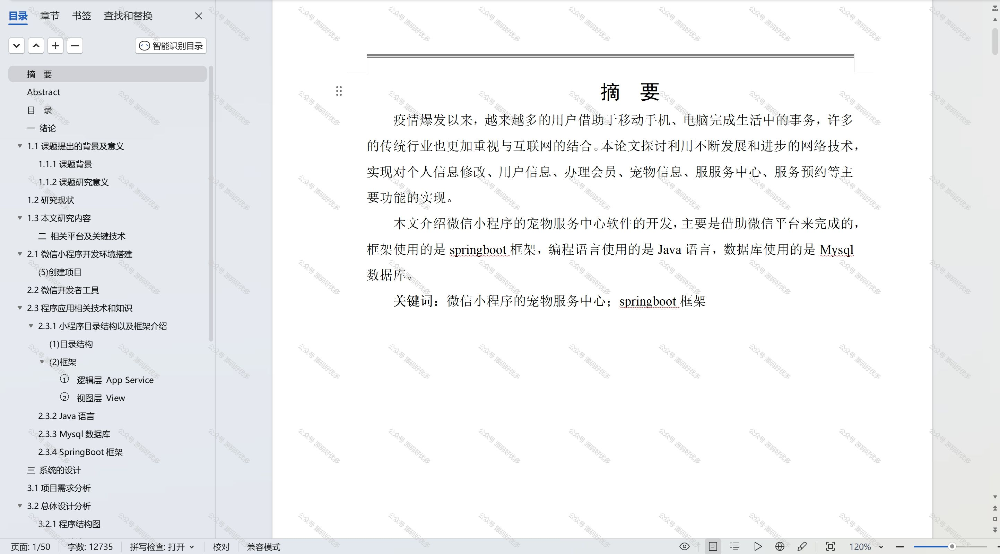

 
## 查看主页获取源码

> **作者介绍**： **✌**全网粉丝10W+本平台特邀作者、博客专家、CSDN新星计划导师、java领域优质创作者,博客之星、掘金/华为云/阿里云/InfoQ等平台优质作者、专注于项目实战 **✌**

  

### 一、作品包含

源码+数据库+设计文档万字+PPT+全套环境和工具资源+部署教程

### 二、项目技术

前端技术：Html、Css、Js、Vue、Element-ui

数据库：MySQL

后端技术：Java、Spring Boot、MyBatis

  

### 三、运行环境

开发工具：IDEA/eclipse + 微信开发者工具

数据库：MySQL5.7

数据库管理工具：Navicat10以上版本

环境配置软件： JDK1.8+Maven3.6.3

前端Nodejs：14

### 四、项目介绍
项目编号：mpweixinA018

"宠物服务中心"微信小程序，立足于为宠物主人提供全方位的宠物服务。它以用户便捷、宠物健康为核心。通过这款小程序，为爱宠带来更舒适、健康的生活。小程序的推出，旨在构建一个宠物服务生态圈，让宠物主人在忙碌的生活中也能更好地照顾自己的宠物。

前台用户功能：浏览首页、服务中心、宠物用品、公告信息、购物车、办理会员、宠物信息、服务预约、我的收藏管理、用户充值、在线咨询、购物车、我的订单。

后台管理员的功能：系统首页、个人中心、用户管理、办理会员管理、宠物类别管理、宠物信息管理、服务类型管理、服务中心管理、服务预约管理、用品分类管理、宠物用品管理、系统管理和订单管理。

### 五、运行截图

  
